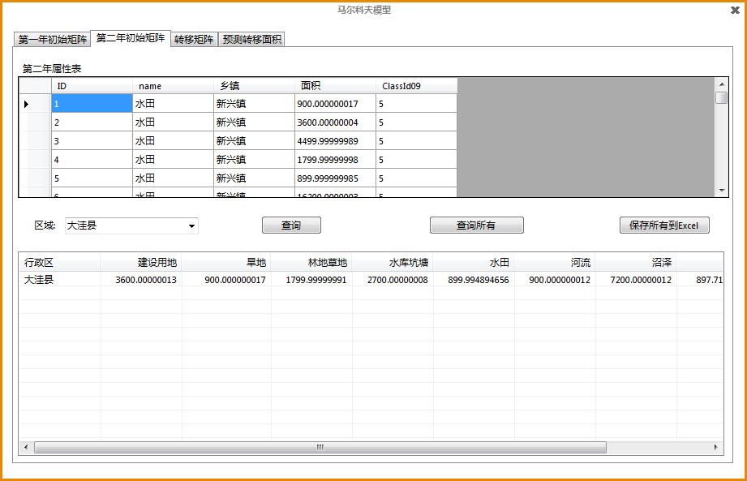
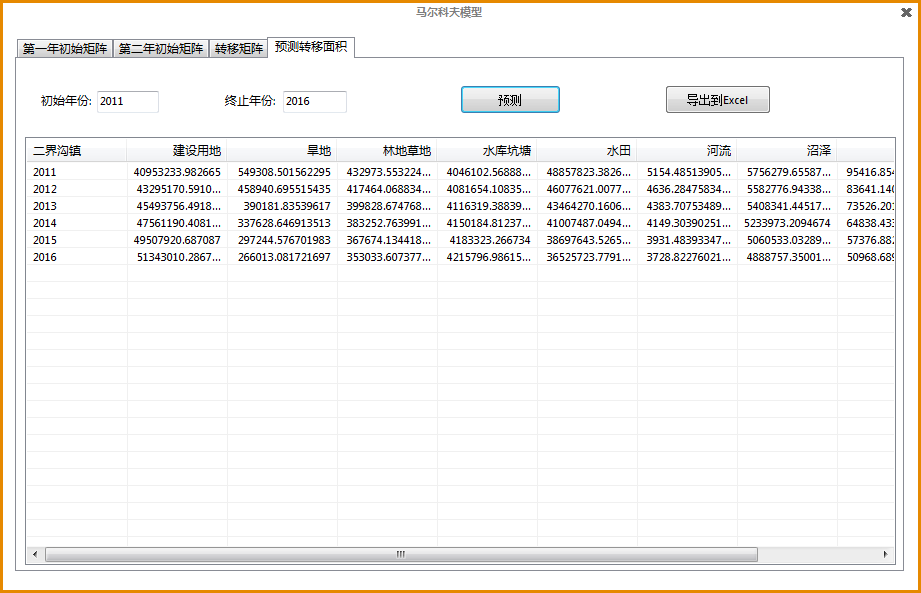

Wetland GIS
===========

This is a land management system include show maps and use Markov Model to calculate the trend of wetland area changes. The map based on SuperMap iObject 6R. This project was completed in July 2013 with three partners. 

This is the main page of this system.

Before open the system, users should login the administrator account.

We can open the geodatabase of Liaodong Bay and show maps in this system. 

In this system, we can inquire the information of features.

Measure actual distance.

   
Print the map.

   

Overlay analysis between two layers, including merge, clip, erase and intersect.

Predict changes in wetlands through Markov Model.

Calculate fields from any layers.

Show statistical graphs.

Draw graphs on the map.

3D map display.(Need DEM data)

For more information please open help.chm

